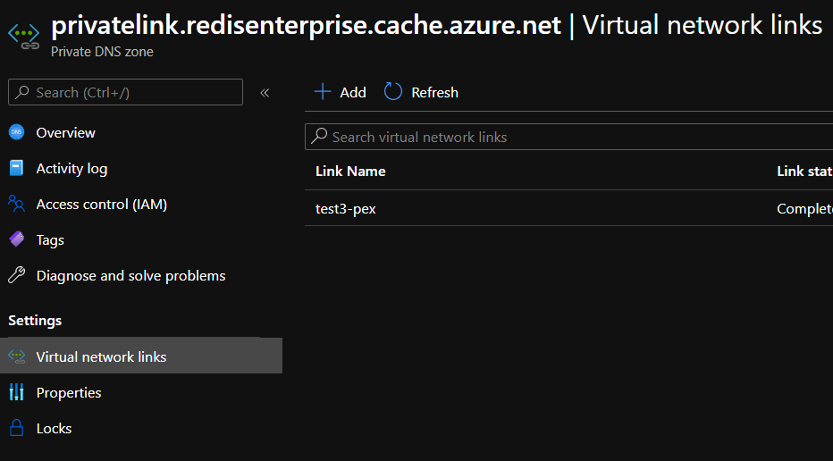
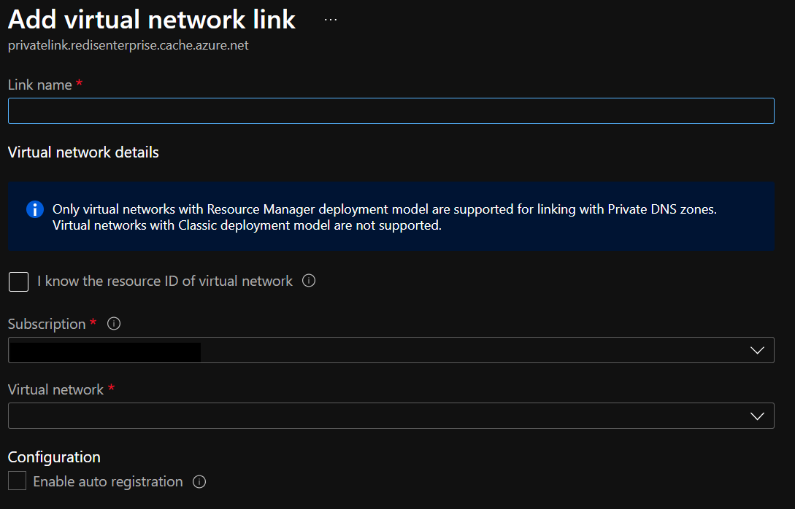
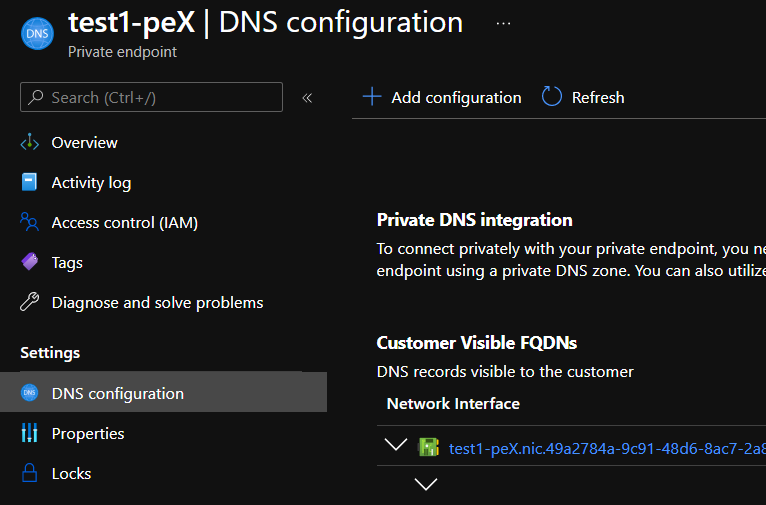

# Migrate to the new Redis Enterprise Private DNS Zone

This document is meant to help you migrate from an old form of the Private DNS Zone that is required to make private endpoints work with Redis Enterprise caches to a new form. The new form is a little simpler, better aligns with other services in Azure, and enables the automatic management of A records in the Private DNS Zone. Throughout this process, your infrastructure will continue to work as expected.

## How to migrate to the new private DNS zone

1. Identify Azure Virtual Networks (VNets) that have a private DNS zone
    using the form:

    ```{region}.privatelink.redisenterprise.cache.azure.net```

2. For each of these VNets, create a new private DNS zone with the
    name:
    
    ```privatelink.redisenterprise.cache.azure.net```

3. Establish a **Virtual network link** between your VNet and the newly
    created zone.

    - Go to the Private DNS zone page for each newly created zone and
        click 'Virtual network links' on the
        left.
        

    - Fill in the "Link Name" with a value of your choosing, "Virtual
        Network" with the VNet being linked, and leave "Enable auto
        registration" unchecked. Click **OK**.
        

4. For each private endpoint linked to that VNet, create a new A record
    using the "DNS Configuration" setting on the left in the portal.

    - Go to the private endpoint page for each private endpoint and click
        **DNS Configuration** on the left.

    - Select **Add configuration**. For `Private DNS zone`, fill in
        your newly created zone. `DNS zone group` should be set to
        "default".

        

    - This adds an A record that matches this pattern:

        ```{cacheName}.{region} -> {private IP address of endpoint}```

>**NOTE**: If you don't follow this procedure and create the
> A record normally, you would still have a working private
> endpoint, but deleting that endpoint does not result in the
> deletion of the corresponding A record.

## Testing your migration

Once all the new DNS zones for each of the VNets are created and all
private endpoints have DNS configurations in the corresponding zones,
it's time to test whether it works.

- To test non-destructively, disconnect all the old ({region}
        prefixed) zones from the VNets they are attached to. Do this using
        the same "Virtual Network Links" options used
        earlier.
- Next, run an 'nslookup' from PowerShell/bash on the cache from a
        virtual machine within the VNet to determine whether it returns the
        IP address of the private endpoint. If your workflow doesn't give
        easy access to a shell, proceed to the next step.
- Run your application to see if everything works as expected.

### Troubleshooting

If the steps above do not work, try re-attaching the old region-prefixed
private DNS zones to fix the issue as a temporary solution.

>**NOTE**: DNS resolution of private zones prefers the longer
> (more-specific) DNS zones if more than one is linked to a VNet. This
> means that if the
> `{region}.privatelink.redisenterprise.cache.azure.net` and
> `privatelink.redisenterprise.cache.windows.net` are both connected,
> only the `{region}.privatelink.redisenterprise.cache.azure.net`
> zone is respected.

## Cleanup

Once you've determined that all private endpoints are working in the new
private DNS zones, it is safe to delete each of the region-prefixed
private DNS zones.
